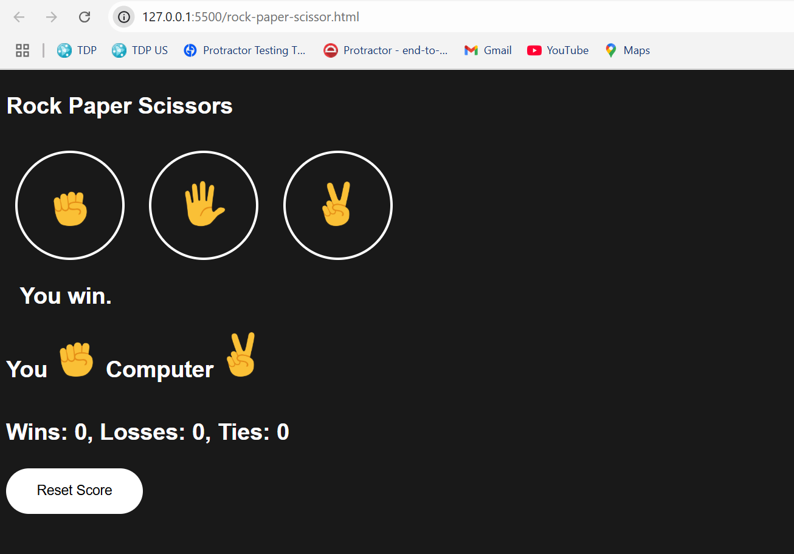

# Rock-Paper-Scissor 🎮✂️🪨📄

A simple and interactive Rock-Paper-Scissor game built using **HTML**, **CSS**, and **JavaScript**.

## ✨ Features

- Interactive buttons for user input (Rock, Paper, Scissors).
- Computer randomly selects its choice.
- Scoreboard to keep track of wins, losses, and ties.
- Score persists even after refreshing the page using **Local Storage**.
- Mobile responsive design.
- Fun emojis for better UI experience!

## 📸 Preview

## 🚀 How to Play

1. Click on either Rock 🪨, Paper 📄, or Scissors ✂️.
2. The computer will make a random choice.
3. The result will be shown instantly along with updated scores.

## 🛠️ Technologies Used

- **HTML5**
- **CSS3**
- **JavaScript**
- **LocalStorage API**

## 📁 Project Structure
📁 Rock-Paper-Scissor
├── rock-paper-scissor.html # Main HTML file
├── rock-paper-scissor.js # JavaScript logic
├── rock-paper-scissors.css # Styling
└── images/ # Game-related images
